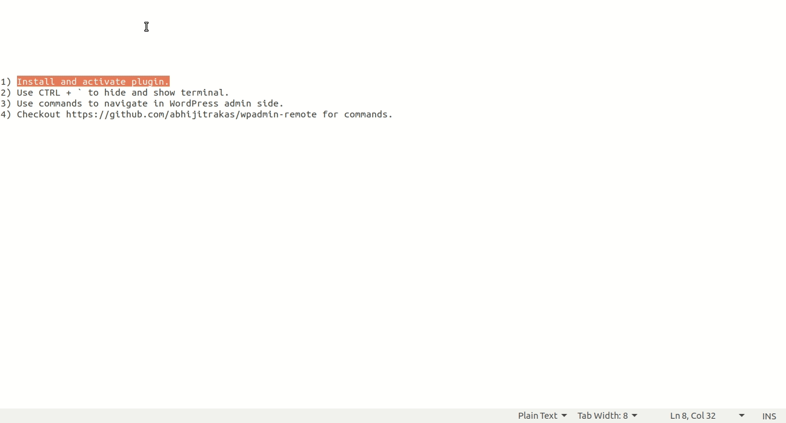

# wpadmin-remote

This Plugin will helps you to navigate in WP admin using various shortcuts with tiny JS terminal.

## Installing

1) Install and activate plugin.
2) Use CTRL + ` to show and hide terminal.
3) Use commands to navigate in WordPress admin site.

## Commands

| Page | Command | Example |
|------|:-------:|:-------:|
| Posts ( All Posts ) | po | po |
| Add New Post | pon | pon |
| Single Post By Passing ID | po `id` | po `123` |
| Search Post | po `search-keyword` | po `Hello World` |
| Post Category | poc | poc |
| Post Tag | pot | pot |
| Media | md | md |
| Add New Media | mdn | mdn |
| Pages (All Pages) | pg | pg |
| Single Page By Passing ID | pg `id` | pg `123` |
| Search Page | pg `search-keyword` | pg `Hello World` |
| Add New Page | pgn | pgn |
| Comments | cm | cm |
| WooCommerce (ALl Orders) | wc | wc |
| WooCommerce Search Order By ID | wc `id` | wc `123` |
| WooCommerce Search Order | wc `search-keyword` | wc `James Bond` |
| WooCommerce New Order | wcn | wcn |
| WooCommerce Coupons | wcc | wcc |
| WooCommerce Add New Coupon | wcn | wcn |
| WooCommerce Reports | wcro | wcro |
| WooCommerce Reposts (Customers) | wcrc | wcrc |
| WooCommerce Reposts (Stock) | wcrs | wcrs |
| WooCommerce Reposts (Taxes) | wcrt | wcrt |
| WooCommerce Settings (General) | wcs | wcs |
| WooCommerce Settings (Products) | wcsp | wcsp |
| WooCommerce Settings (Tax) | wcstx | wcstx |
| WooCommerce Settings (Shipping) | wcss | wcss |
| WooCommerce Settings (Payment) | wcspyt | wcspyt |
| WooCommerce Settings (Accoount & Privacy) | wcsap | wcsap |
| WooCommerce Settings (Email) | wcse | wcse |
| WooCommerce Settings (Advanced) | wcsa | wcsa |
| WooCommerce Status (System Status) | wcst | wcst |
| WooCommerce Status (Tools) | wcstt | wcstt |
| WooCommerce Status (Logs) | wcstl | wcstl |
| WooCommerce Extension (Browse Extesion) | wce | wce |
| WooCommerce Extension (Subscription) | wces | wces |
| WooCommerce Product (All Products) | wcp | wcp |
| WooCommerce Search Product By ID | wcp `id` | wcp `123` |
| WooCommerce Search Product | wcp `search-keyword` | wcp `Ray-Ban Sun Glasses` |
| WooCommerce Product (Add New) | wcpn | wcpn |
| WooCommerce Product (Category) | wcpc | wcpc |
| WooCommerce Product (Tags) | wcpt | wcpt |
| WooCommerce Product (Attributes) | wcpa | wcpa |
| Appearance (Themes) | at | at |
| Appearance (Customize) | ac | ac |
| Appearance (Widgets) | aw | aw |
| Appearance (Menus) | am | am |
| Appearance (Menus Location) | aml | aml |
| Appearance (Editor) | ae | ae |
| Plugins (All Plugins) | pi | pi |
| Plugins (Add New Plugin) | pn | pn |
| Plugins (Editors) | pe | pe |
| Users (All Users) | ua | ua |
| Users (Add New User) | un | un |
| Users (Your Profile) | up | up |
| Tools (Available Tools) | ta | ta |
| Tools (Import) | ti | ti |
| Tools (Export) | te | te |
| Tools (Export Personal Data) | tepd | tepd |
| Tools (Erase Personal Data) | teepd | teepd |
| Settings (General) | sg | sg |
| Settings (Writing) | sw | sw |
| Settings (Reading) | sr | sr |
| Settings (Discussion) | sd | sd |
| Settings (Media) | sm | sm |
| Settings (Permalinks) | sp | sp |
| Settings (Privacy) | spr | spr |
